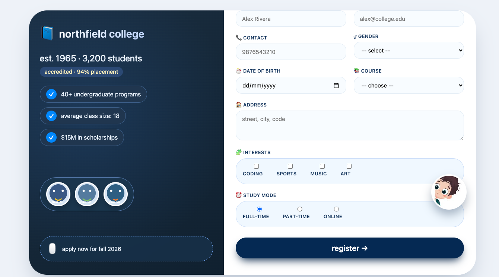

# 🎓 StudentFormPortal

A modern and animated student registration form built using HTML, CSS, and JavaScript.

This project demonstrates real-time form validation, dynamic UI updates, and a live student summary panel with a clean and professional design.

---

## 📌 Project Overview

StudentFormPortal is a frontend-based college registration form UI that includes:

- Real-time validation  
- Live summary display  
- Modern responsive layout  
- Interactive cartoon animation  
- Clean structured design  

---

## 🚀 Features

- Full Name Validation  
- Email Format Validation  
- 10-Digit Contact Number Validation  
- Required Field Checking  
- Gender Selection  
- Course Dropdown  
- Date Picker  
- Address Field  
- Interests (Multiple Selection)  
- Study Mode (Radio Buttons)  
- Live Student Summary Panel  
- Modern College Landing Section UI  

---

## 🛠️ Technologies Used

- HTML5  
- CSS3  
- JavaScript   

---

## 📂 Folder Structure

task3/
│
├── index.html
├── main.css
├── stu.js
├── README.md
└── images/
├── image screenShot.png
├── images1.jpeg

---

## 📸 Screenshot

Make sure the image file name matches exactly with the file inside the images folder.

---

## ▶️ How To Run

1. Open the project folder in VS Code  
2. Open `index.html`  
3. Right click → Open with Live Server  
4. Fill the form and test validation  

---

👨‍💻 Author

Dinanath Mishra
MCA Graduate
Frontend Developer | Java & Spring Boot Learner

⭐ If you like this project, consider giving it a star on GitHub.